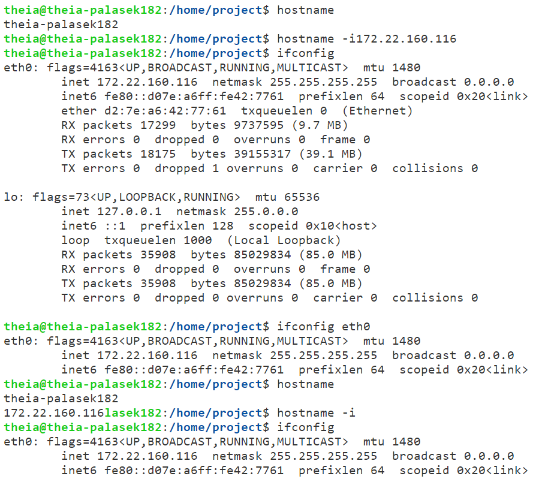
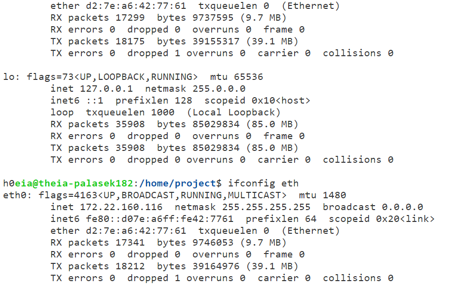
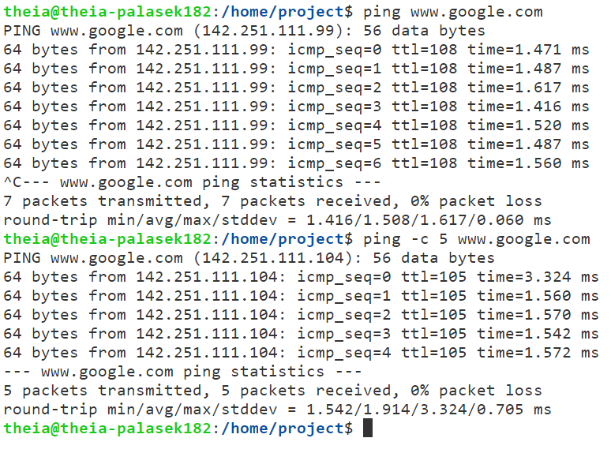
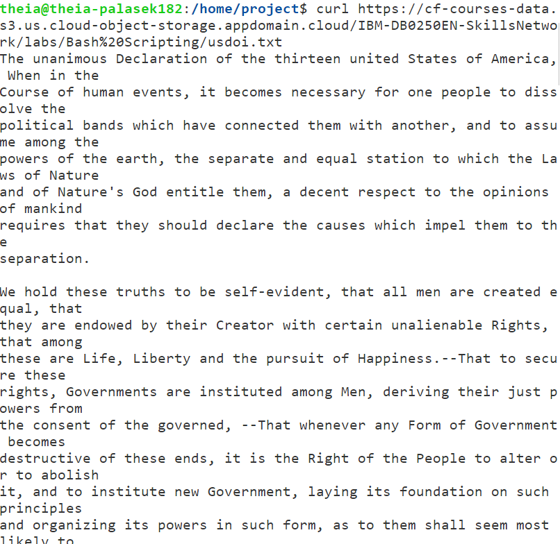
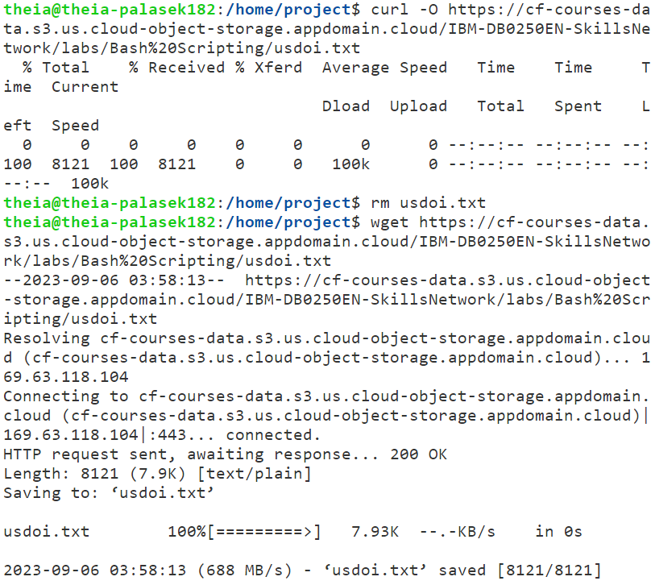
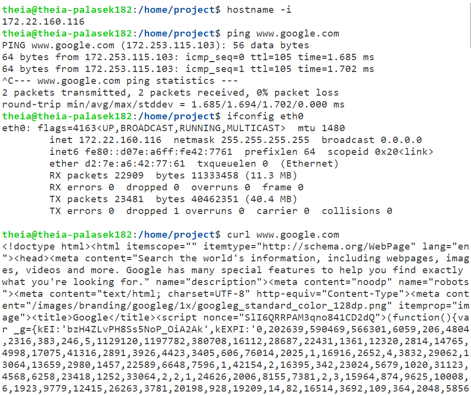

# Exercise 1 - View configuration info about your network

# Exercise 2 - Test network connectivity

# Exercise 3 - View or download data from a server

# Practice Test - Working with Networking Commands

