# Exercise 1 - Viewing file contents
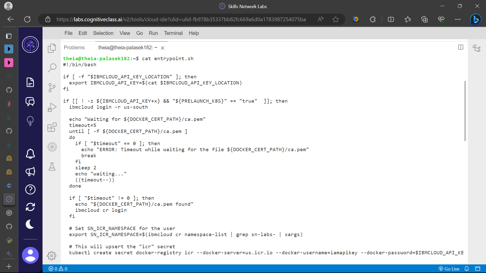
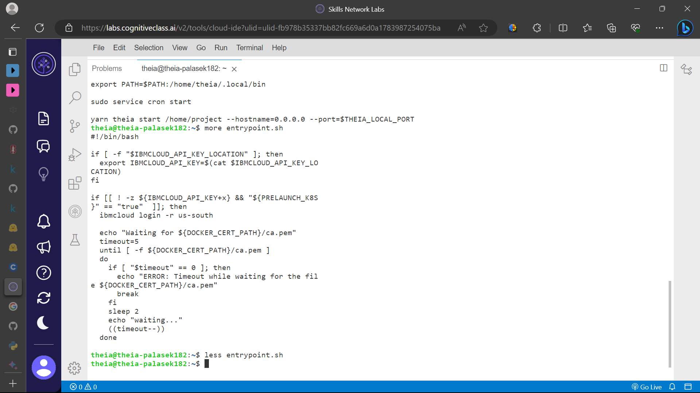
# Exercise 2 - Viewing text file contents
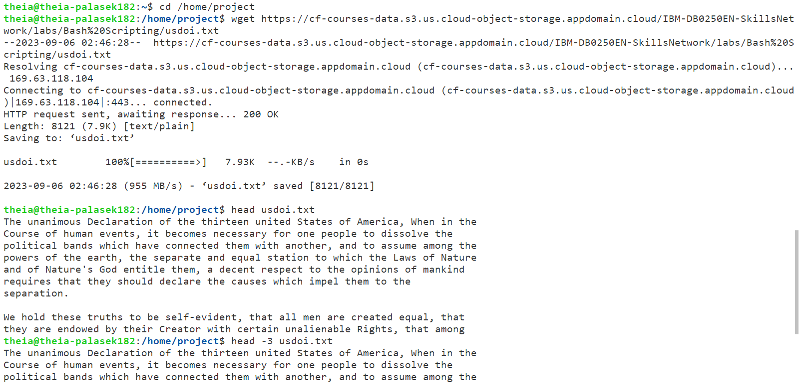
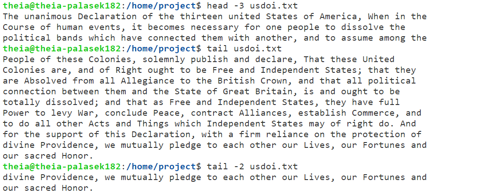
# Exercise 3 - Getting basic text file stats
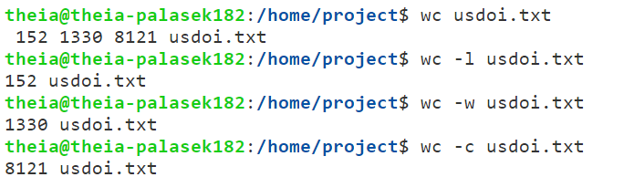
# Exercise 4 - Basic text wrangling: sorting lines and dropping duplicates
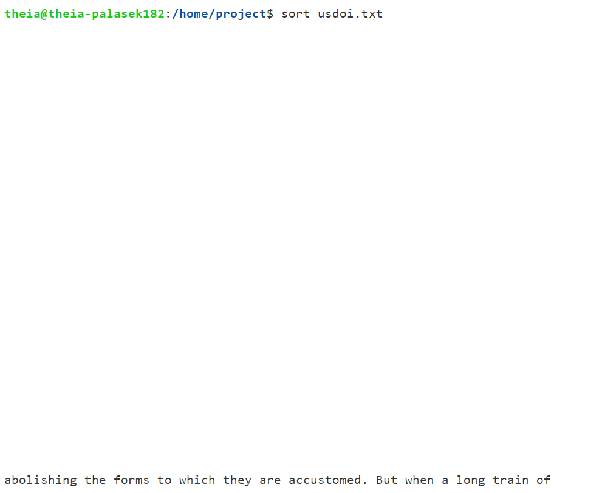
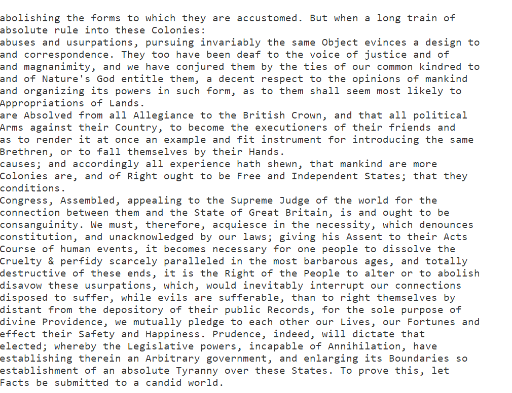
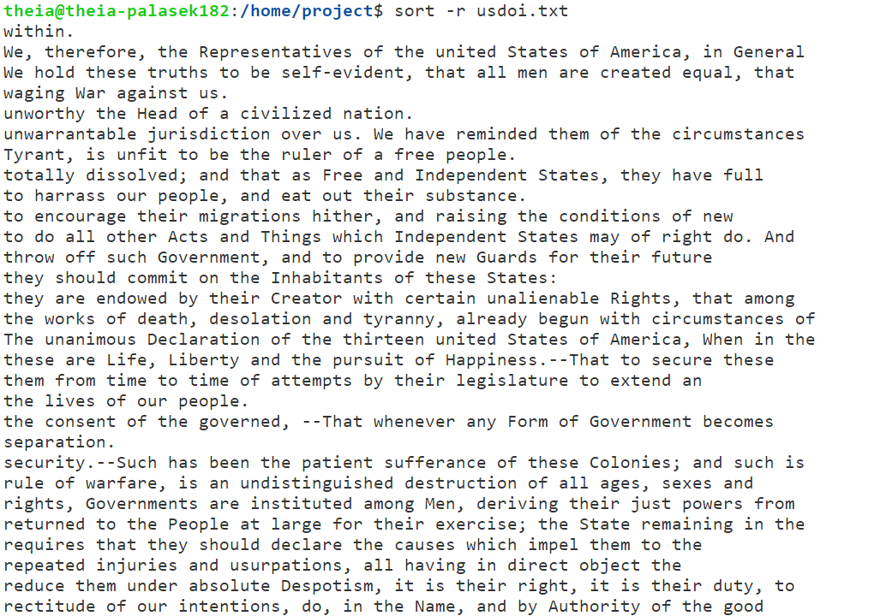
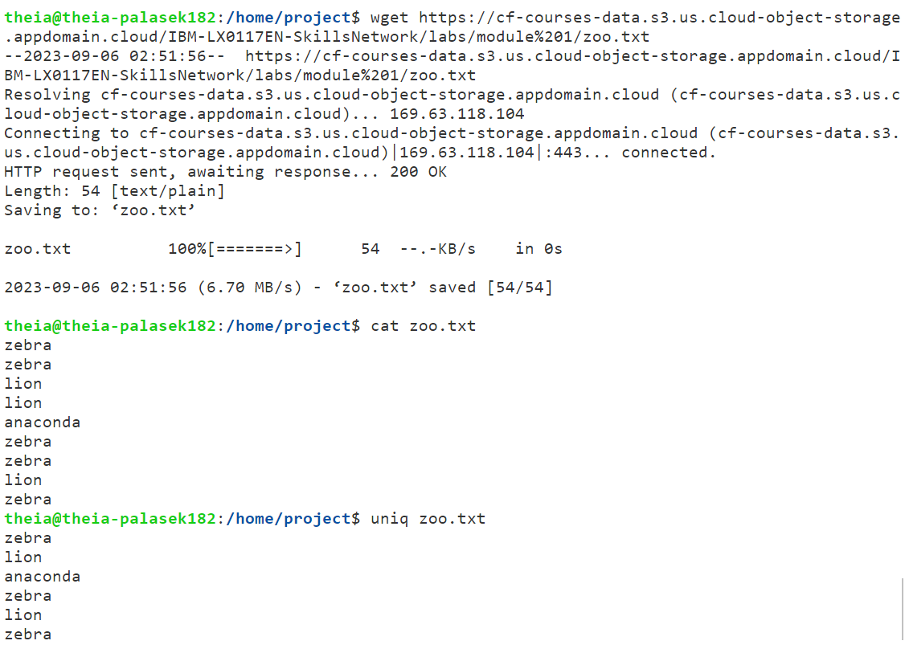
# Exercise 5 - Basic text wrangling: extracting lines and fields
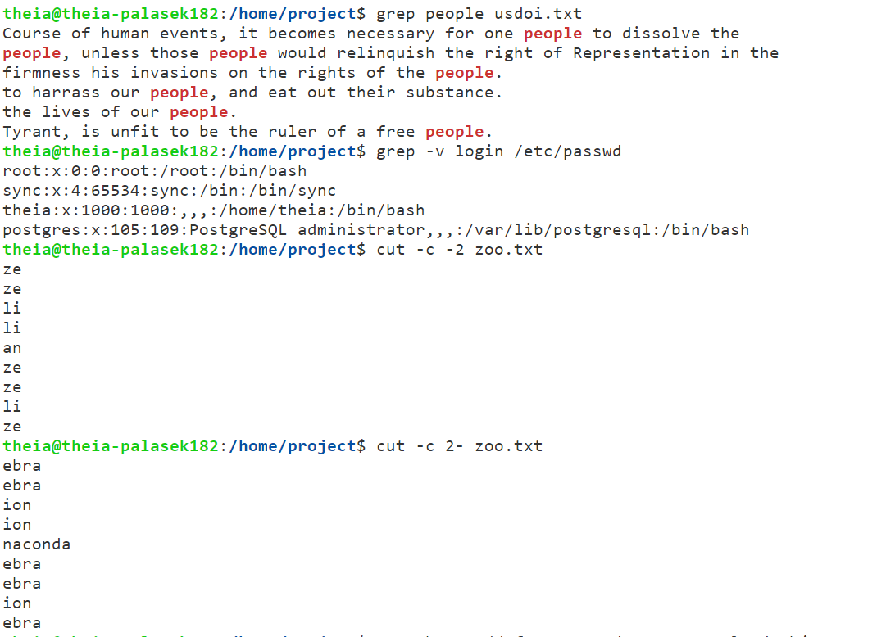
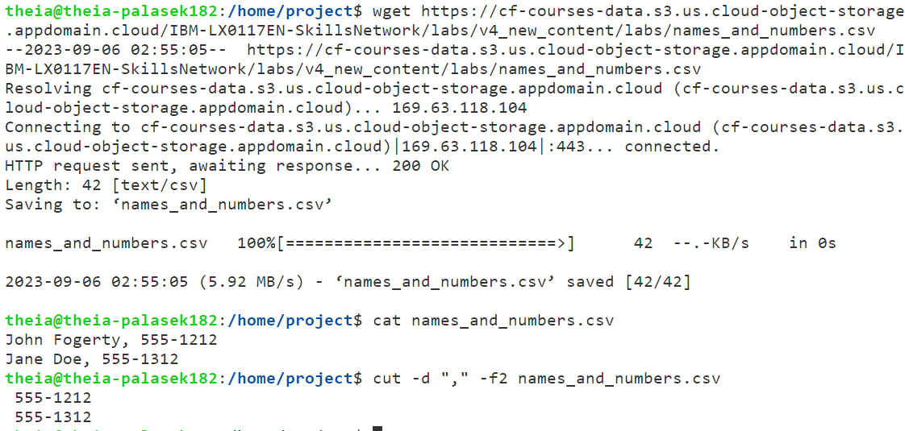
# Exercise 6 - Basic text wrangling: merging lines as fields
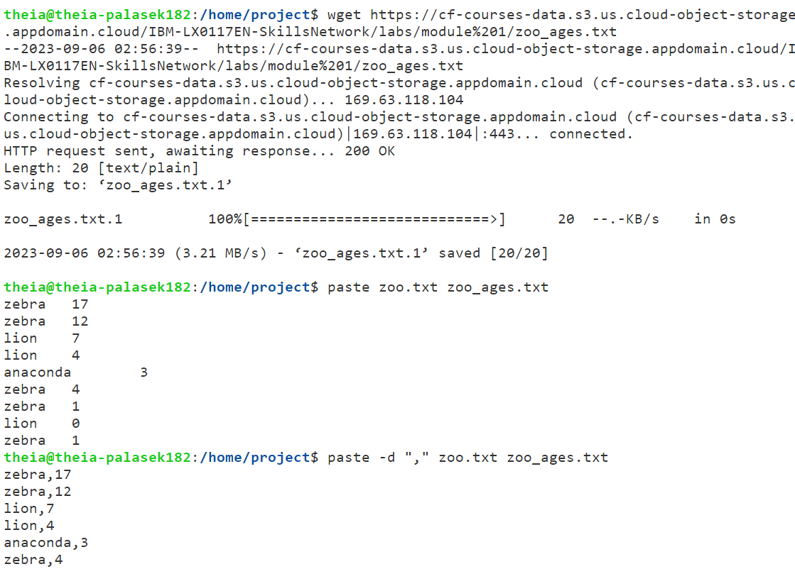
# Practice Exercises
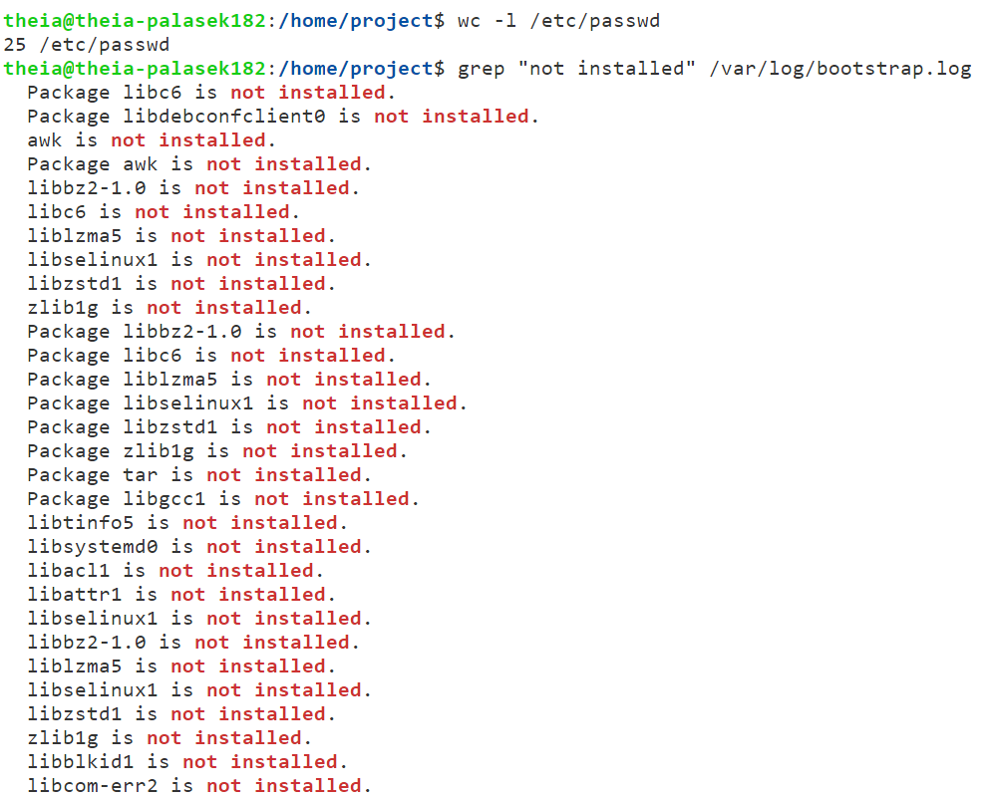
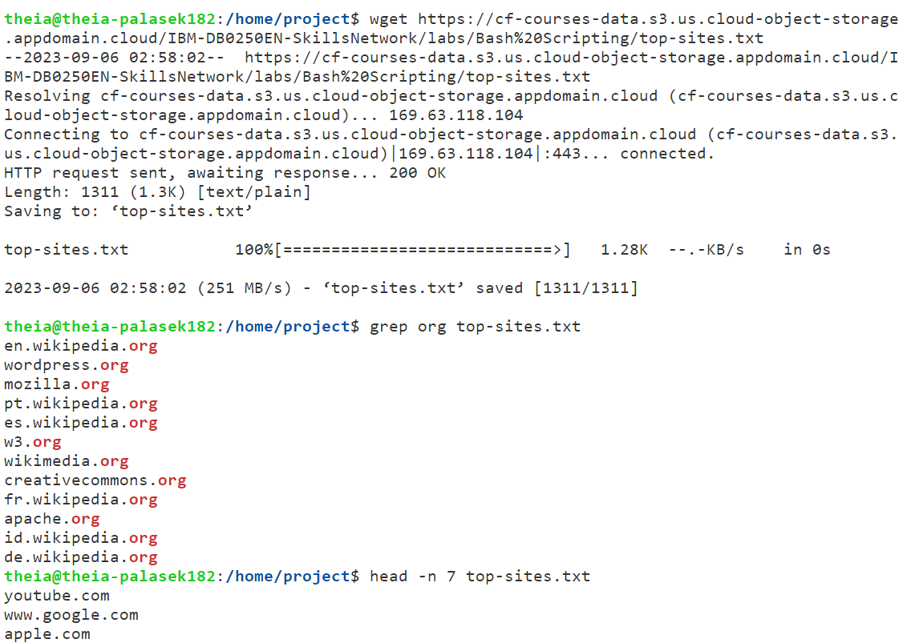
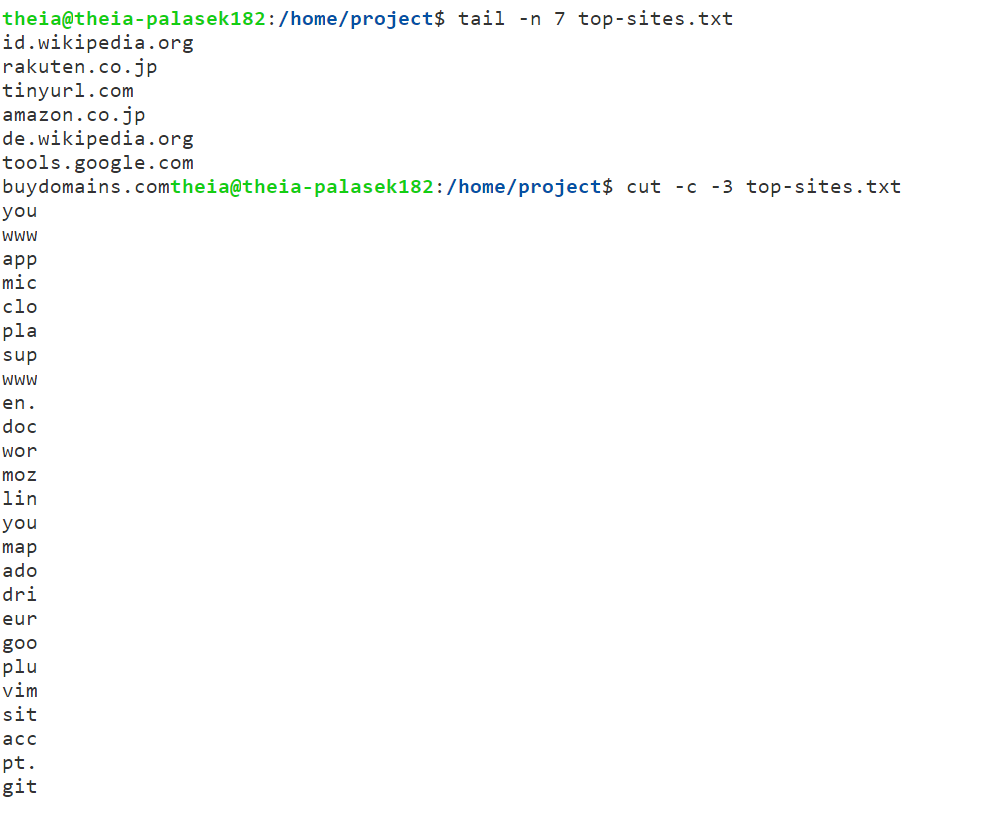
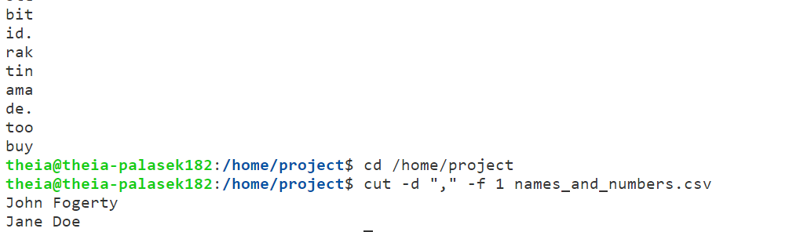