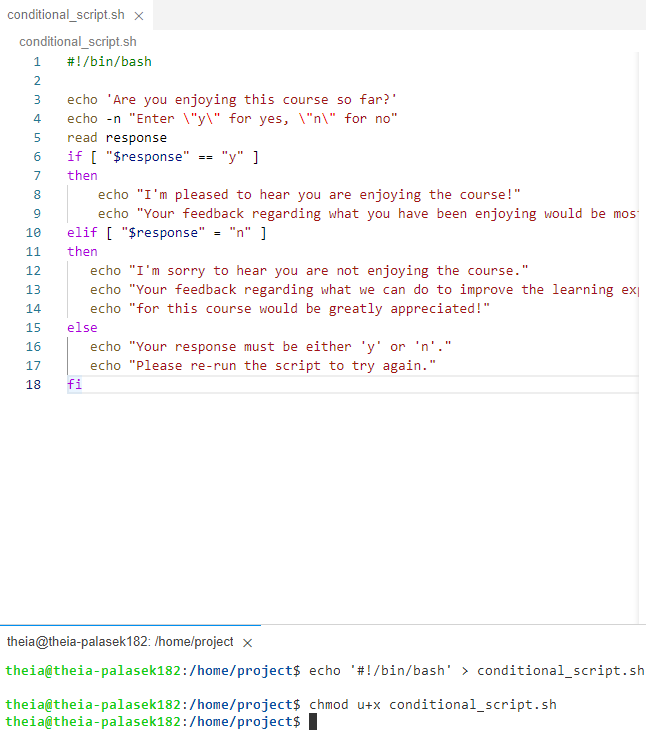
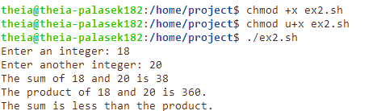
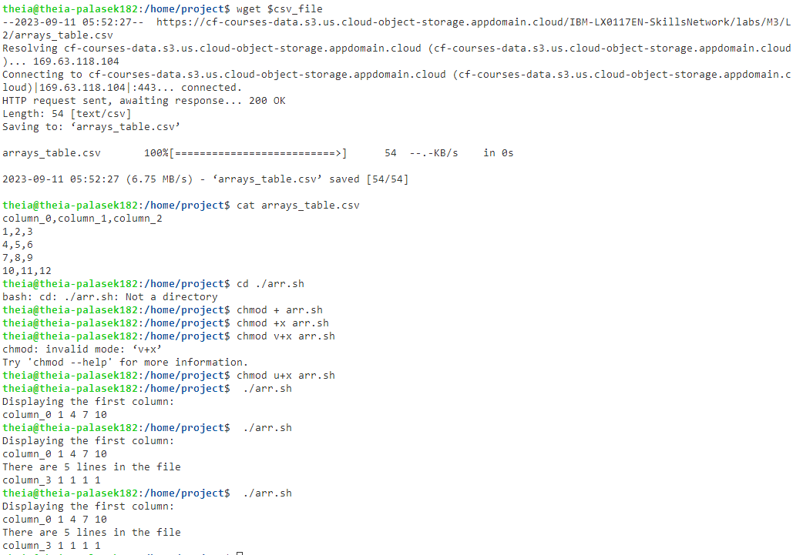

# Exercise 1 - Using conditional statements and logical operators

# Exercise 2 - Performing basic mathematical calculations and numerical logical comparisons

# Exercise 3 - Using arrays for storing and accessing data within for loops
