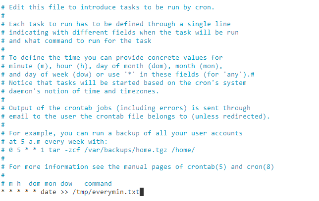

# Exercise 1 - Understand crontab file syntax

# Exercise 2 - List cron jobs
theia@theia-palasek182:/home/project$ crontab -l
> no crontab for theia

# Exercise 3 - Add a job in the crontab file

# Exercise 4 - Remove the current crontab
theia@theia-palasek182:/home/project$ crontab -r\
theia@theia-palasek182:/home/project$ crontab -l
> no crontab for theia

# Practice exercises
theia@theia-palasek182:/home/project$ crontab -e\
no crontab for theia - using an empty one\
crontab: installing new crontab
