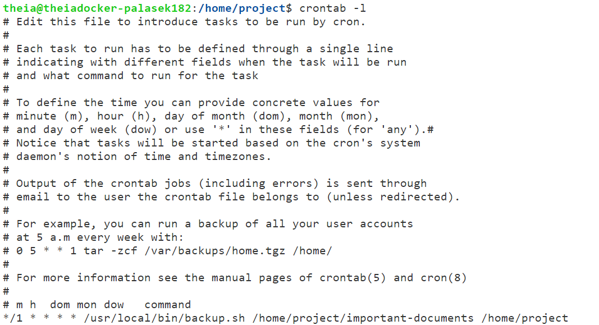

# Task 0
theia@theiadocker-palasek182:/home/project$ wget https://cf-courses-data.s3.us.cloud-object-storage.appdomain.cloud/IBM-LX0117EN-SkillsNetwork/labs/Final%20Project/backup.sh\
--2023-09-11 11:37:56--  https://cf-courses-data.s3.us.cloud-object-storage.appdomain.cloud/IBM-LX0117EN-SkillsNetwork/labs/Final%20Project/backup.sh\
Resolving cf-courses-data.s3.us.cloud-object-storage.appdomain.cloud (cf-courses-data.s3.us.cloud-object-storage.appdomain.cloud)... 169.63.118.104\
Connecting to cf-courses-data.s3.us.cloud-object-storage.appdomain.cloud (cf-courses-data.s3.us.cloud-object-storage.appdomain.cloud)|169.63.118.104|:443... connected.\
HTTP request sent, awaiting response... 200 OK\
Length: 1071 (1.0K) [text/x-sh]\
Saving to: ‘backup.sh’

backup.sh          100%[==============>]   1.05K  --.-KB/s    in 0s      

2023-09-11 11:37:56 (172 MB/s) - ‘backup.sh’ saved [1071/1071]

# Task 1 - 13
modifying backup.sh to include the following required values

# Task 14
open terminal file

# Task 15
theia@theiadocker-palasek182:/home/project$ ls -l backup.sh\
-rwxr--r-- 1 theia users 1376 Sep 11 11:56 backup.sh

# Task 16
theia@theiadocker-palasek182:/home/project$ wget https://cf-courses-data.s3.us.cloud-object-storage.appdomain.cloud/IBM-LX0117EN-SkillsNetwork/labs/Final%20Project/important-documents.zip\
--2023-09-11 11:57:56--  https://cf-courses-data.s3.us.cloud-object-storage.appdomain.cloud/IBM-LX0117EN-SkillsNetwork/labs/Final%20Project/important-documents.zip\
Resolving cf-courses-data.s3.us.cloud-object-storage.appdomain.cloud (cf-courses-data.s3.us.cloud-object-storage.appdomain.cloud)... 169.63.118.104\
Connecting to cf-courses-data.s3.us.cloud-object-storage.\
appdomain.cloud (cf-courses-data.s3.us.cloud-object-storage.\
appdomain.cloud)|169.63.118.104|:443... connected.\
HTTP request sent, awaiting response... 200 OK\
Length: 4995 (4.9K) [application/zip]\
Saving to: ‘important-documents.zip’

important-document 100%[==============>]   4.88K  --.-KB/s    in 0s      

2023-09-11 11:57:56 (462 MB/s) - ‘important-documents.zip’ saved [4995/4995]

theia@theiadocker-palasek182:/home/project$ unzip -DDo important-documents.zip\
Archive:  important-documents.zip\
   creating: important-documents/\
  inflating: important-documents/zop.txt \
  inflating: important-documents/ana.txt  \
  inflating: important-documents/doi.txt  \
theia@theiadocker-palasek182:/home/project$ touch important-documents/*\
theia@theiadocker-palasek182:/home/project$ ./backup.sh important-documents .\
./backup.sh: line 19: important-documents: command not found\
./backup.sh: line 20: .: filename argument required\
.: usage: . filename [arguments]\
targetDirectory is important-documents\
destinationDirectory is .\
./backup.sh: line 40: /home/project: Is a directory\
tar: Cowardly refusing to create an empty archive\
Try 'tar --help' or 'tar --usage' for more information.
mv: missing destination file operand after 'backup-1694447898.tar.gz'\
Try 'mv --help' for more information.\
theia@theiadocker-palasek182:/home/project$ ls -l\
total 16\
-rwxr--r-- 1 theia users 1376 Sep 11 11:56 backup.sh\
drwxr-sr-x 2 theia users 4096 Sep 11 11:58 important-documents\
-rw-r--r-- 1 theia users 4995 Sep 28  2022 important-documents.zip

# Task 17
theia@theiadocker-palasek182:/home/project$ sudo cp backup.sh /usr/local/bin/\
theia@theiadocker-palasek182:/home/project$ crontab -e\
no crontab for theia - using an empty one\
crontab: installing new crontab\
theia@theiadocker-palasek182:/home/project$ sudo service cron start\
'* Starting periodic command scheduler cron\
   ...done.\
theia@theiadocker-palasek182:/home/project$ crontab -l\
\
theia@theiadocker-palasek182:/home/project$ ls -a\
.  ..  backup.sh  important-documents  important-documents.zip\
theia@theiadocker-palasek182:/home/project$ sudo service cron stop\
'* Stopping periodic command scheduler cron
   ...done.

# Task 18
download backup.sh and doneeeeeeeee