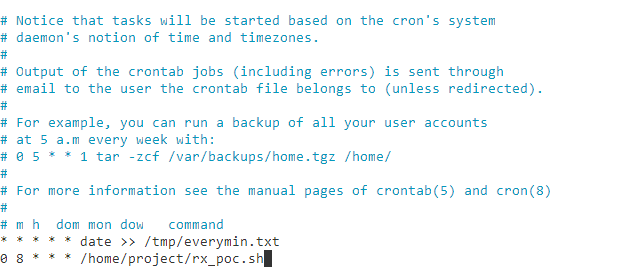

# Exercise 1 - Initialize your weather report log file
theia@theia-palasek182:/home/project$ touch rx_poc.log\
theia@theia-palasek182:/home/project$ header= (echo -e "year\tmonth\tday\tobs_tmp\tfc_temp")\
theia@theia-palasek182:/home/project$ echo header>rx_poc.log\
theia@theia-palasek182:/home/project$ cat rx_poc.log
> year month day obs_tmp fc_temp

# Exercise 2 - Download the raw weather data
chmod u+x rx_poc.sh\
theia@theia-palasek182:/home/project$ ./rx_poc.sh
> % Total    % Received % Xferd  Average Speed   Time    Time     Time  Current\
                                 Dload  Upload   Total   Spent    Left  Speed\
100  9159  100  9159    0     0   3498      0  0:00:02  0:00:02 --:--:--  3497

# Exercise 3 - Extract and load the required data

# Exercise 4 - Schedule your Bash script rx_poc.sh to run every day at noon local time
theia@theia-palasek182:/home/project$ date
Mon Sep 11 07:00:03 EDT 2023 \
theia@theia-palasek182:/home/project$ date -u
Mon Sep 11 11:00:08 UTC 2023 \
theia@theia-palasek182:/home/project$ crontab -e\
crontab: installing new crontab\

# Exercise 5 - Create a script to report historical forecasting accuracy
theia@theia-palasek182:/home/project$ echo -e \"year\tmonth\tday\tobs_tmp\tfc_temp\taccuracy\taccuracy_range" > historical_fc_accuracy.tsv

# Exercise 6 - Create a script to report weekly statistics of historical forecasting accuracy
theia@theia-palasek182:/home/project$ wget https://cf-courses-data.s3.us.cloud-object-storage.appdomain.cloud/IBMSkillsNetwork-LX0117EN-Coursera/labs/synthetic_historical_fc_accuracy.tsv\
--2023-09-11 07:08:31--  https://cf-courses-data.s3.us.cloud-object-storage.appdomain.cloud/IBMSkillsNetwork-LX0117EN-Coursera/labs/synthetic_historical_fc_accuracy.tsv\
Resolving cf-courses-data.s3.us.cloud-object-storage.appdomain.cloud (cf-courses-data.s3.us.cloud-object-storage.appdomain.cloud)... 169.63.118.104\
Connecting to cf-courses-data.s3.us.cloud-object-storage.appdomain.cloud (cf-courses-data.s3.us.cloud-object-storage.appdomain.cloud)|169.63.118.104|:443... connected.\
HTTP request sent, awaiting response... 200 OK\
Length: 263 [text/tab-separated-values]\
Saving to: ‘synthetic_historical_fc_accuracy.tsv’

synthetic_historical_f 100%[==========================>]     263  --.-KB/s    in 0s    

2023-09-11 07:08:31 (39.8 MB/s) - ‘synthetic_historical_fc_accuracy.tsv’ saved [263/263]